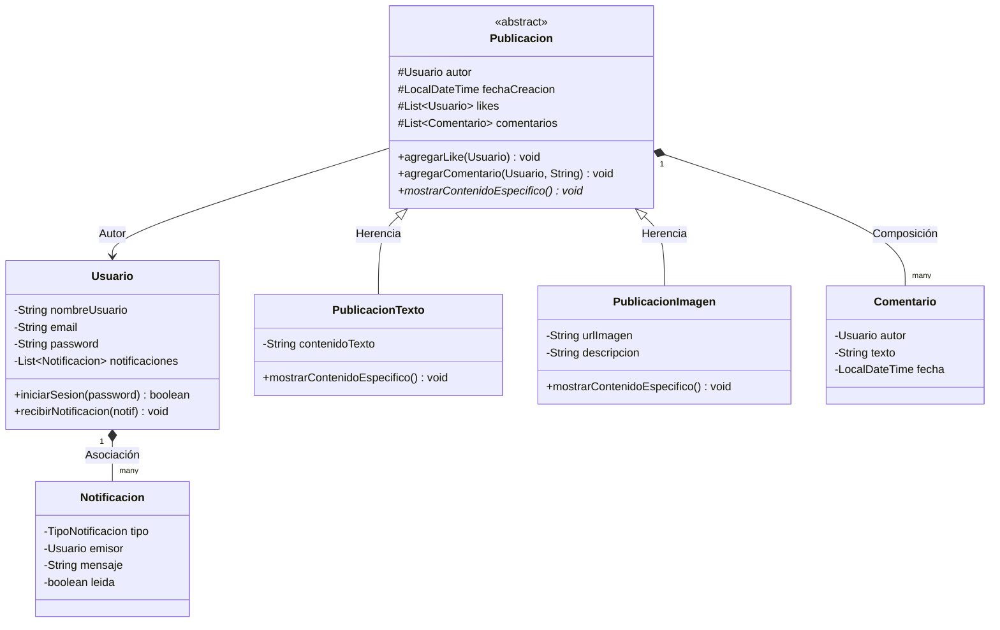

<div align="center">
  <h1>☕ KonnektApp — Simulador de Red Social</h1>
  <p><strong>Aplicación de escritorio en Java con interfaz gráfica Swing y arquitectura Modelo-Vista-Controlador (MVC)</strong></p>
  <p>
    
    
    
    
    
  </p>
</div>

---

## 📌 Descripción General

**KonnektApp** es un simulador de red social de escritorio desarrollado en **Java**. Demuestra la aplicación rigurosa de los cuatro pilares de la **Programación Orientada a Objetos (POO)**: Abstracción, Encapsulamiento, Herencia y Polimorfismo, estructurado bajo el patrón de diseño arquitectónico **Modelo-Vista-Controlador (MVC)** con interfaz gráfica en **Java Swing**.

La aplicación permite la gestión de sesiones de usuario (registro e inicio de sesión), creación de publicaciones polimórficas (texto enriquecido e imágenes/multimedia), interacción social mediante *likes*, sistema de hilos de comentarios y un gestor dinámico de notificaciones para los autores.

---

## 🏛️ Arquitectura y Principios de Diseño

### 1. Patrón Modelo - Vista - Controlador (MVC)
El proyecto se encuentra estrictamente desacoplado en tres capas dentro del paquete `com.konnekt`:

* **`com.konnekt.modelo` (Dominio):** Clases de entidad que representan la lógica del negocio (`Usuario`, `Publicacion`, `PublicacionTexto`, `PublicacionImagen`, `Comentario`, `Notificacion`, `TipoNotificacion`).
* **`com.konnekt.controlador` (Lógica de Negocio):** Orquestador central (`Konnekt.java`) que gestiona la colección de usuarios en memoria, la autenticación y las reglas de negocio.
* **`com.konnekt.vista` (Presentación):** Formularios e interfaces gráficas interactivas construidas con **Java Swing** (`LoginFrame`, `RegistroFrame`, `MainFrame`).

### 2. Demostración de Pilares POO

* **Clases Abstractas y Herencia:** `Publicacion` actúa como clase base abstracta de la cual heredan `PublicacionTexto` y `PublicacionImagen`, reutilizando el manejo de fecha, autor, likes y comentarios.
* **Polimorfismo dinámico:** Cada subclase de `Publicacion` implementa su propia versión del método abstracto `mostrarContenidoEspecifico()`, permitiendo renderizar diferentes tipos de contenidos en una misma colección polimórfica (`List<Publicacion>`).
* **Encapsulamiento estricto:** Atributos protegidos y privados con getters, setters y métodos de mutación controlados (e.g. `agregarLike`, `agregarComentario`) que previenen estados inconsistentes.
* **Uso de Genéricos y Enums:** Colecciones tipadas (`List<Usuario>`, `List<Comentario>`) y enumeraciones (`TipoNotificacion.NUEVO_LIKE`, `TipoNotificacion.NUEVO_COMENTARIO`) para evitar *magic strings*.

---

## 📊 Diagrama de Clases (UML)



---

## 📁 Estructura del Código Fuente

```
KonnektApp/
├── src/
│   └── com/
│       └── konnekt/
│           ├── modelo/             # Capa del Dominio / Entidades
│           │   ├── Usuario.java
│           │   ├── Publicacion.java (Clase Abstracta)
│           │   ├── PublicacionTexto.java
│           │   ├── PublicacionImagen.java
│           │   ├── Comentario.java
│           │   ├── Notificacion.java
│           │   └── TipoNotificacion.java (Enum)
│           ├── controlador/        # Orquestación y lógica central
│           │   ├── Konnekt.java
│           │   └── KonnektApp.java (Entry Point)
│           └── vista/              # Formularios Swing (.java y .form)
│               ├── LoginFrame.java
│               ├── RegistroFrame.java
│               └── MainFrame.java
├── build.xml                       # Configuración de compilación Apache Ant
└── manifest.mf                     # Manifiesto de ejecución
```

---

## 🚀 Requisitos y Ejecución

### Prerrequisitos
* **Java Development Kit (JDK):** Versión 8, 11, 17 o superior.
* **IDE (Opcional):** NetBeans, IntelliJ IDEA o Eclipse.

### Compilación y Ejecución desde NetBeans / IDE
1. Abre NetBeans y selecciona **File > Open Project**.
2. Selecciona la carpeta `KonnektApp`.
3. Haz clic derecho en el proyecto y selecciona **Run** (o presiona `F6`).

### Compilación y Ejecución desde Terminal (Ant / javac)
```bash
# Compilar con Apache Ant
ant compile

# Ejecutar el proyecto
ant run
```

O directamente con `javac`:
```bash
javac -d bin -sourcepath src src/com/konnekt/controlador/KonnektApp.java
java -cp bin com.konnekt.controlador.KonnektApp
```

---

## 📄 Licencia

Este proyecto se distribuye bajo la Licencia **MIT**. Consulta el archivo `LICENSE` para más información.
